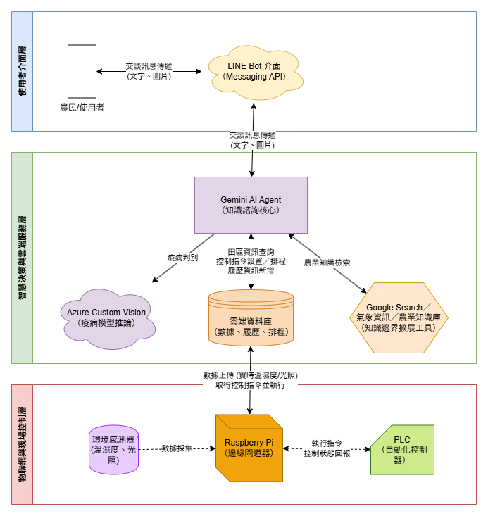

## AIoT 智慧農業決策助理系統：整合知識諮詢與設施自動化

### AIoT Smart Agriculture Decision Assistant System: Integrating Knowledge Consulting and Facility Automation

---

### **指導教授：**

**林錦財 教授**

### **組員：**

**張翊飛** **翁靖軒**

---

中華民國 114 年 6 月 (或根據實際完成日期填寫)

## 第 1 章 緒論與動機 (Introduction and Motivation)

### 1.1 研究背景與專案動機

#### **1.1.1 時代背景：傳統農業轉型與挑戰**

* **現狀分析：** 簡述全球及本地農業正面臨的挑戰，如極端氣候、病蟲害威脅、農業人口老化與技術斷層等。  
* **痛點與需求：** 傳統農民缺乏**即時、整合**的決策輔助工具。例如：  
  * **知識獲取效率低：** 遇到病蟲害時，需要花費大量時間翻閱資料或等待專家。  
  * **農場管理缺乏精準度：** 依賴經驗判斷澆水、施肥時機，導致資源浪費或產量不穩。

#### **1.1.2 專案動機：開發整合性智慧決策系統**

* **核心目標：** 鑑於上述挑戰，本專題的動機是整合**知識諮詢 (AI/資料庫)** 與**設施自動化 (IoT/自動控制)**，開發一套一站式的「智慧農業助理系統」。  
* **願景：** 旨在成為農民的虛擬助手，降低決策門檻，實現**精準農業 (Precision Agriculture)**，提升作物產量與品質。

---

### 1.2 專案目的

本專案旨在達成以下三個主要目標，以解決農民在知識、管理和決策上的痛點：

1. **建立即時農業知識諮詢能力：**  
   * **\[目標 1.1 \- 疾病快速判別\]**：實作**植物疫病判別**功能，讓農民能透過照片或其他輸入，**即時**獲得病蟲害的初步診斷和應對建議。  
   * **\[目標 1.2 \- 資訊整合\]**：整合 **Google 搜尋**與**農業資料庫**檢索，提供全面且可信賴的農業知識查詢服務。  
2. **實現農場設施的智能化監控與控制：**  
   * **\[目標 2.1 \- 數據實時掌握\]**：開發介面，能**實時查詢**實體氣象站的環境資訊（如溫濕度、光照）。  
   * **\[目標 2.2 \- 自動化控制\]**：實作**自動澆水功能**，可依據環境數據或預設排程進行精準灌溉。  
   * **\[目標 2.3 \- 效率管理\]**：提供**工作排程**功能，協助農民規劃、追蹤和提醒農事活動。  
3. **建構作物生長數據的數位化履歷：**  
   * **\[目標 3.1 \- 履歷記錄\]**：設計介面以**數位化**方式便捷地紀錄作物從播種到收成的**生長、用藥、施肥**等關鍵數據。

---

### 1.3 專案範疇與限制

#### **1.3.1 專案範疇 (Scope)**

* 本專案將針對**特定作物類別**（例如：葉菜類或某種經濟作物）進行疫病模型的訓練與系統優化。  
* 系統將包含**前端介面 (如 App 或 Web)** 供農民操作，以及**後端數據處理**與**物聯網 (IoT) 模組**的連接。

#### **1.3.2 專案限制 (Limitation)**

* **硬體限制：** 實體氣象站及自動澆水功能將使用**原型 (Prototype) 硬體**進行模擬驗證，非大規模商業部署。  
* **數據限制：** 疫病判別模型的準確度受限於可取得的**訓練資料集數量與品質**。  
* **知識庫限制：** 知識諮詢主要基於**公開資料庫與搜尋引擎**，無法完全取代專業農學專家的現場診斷。

---

### 1.4 專題報告架構

本報告將依序說明「智慧農業助理」專案的執行過程與成果：

* **第 2 章：** 探討智慧農業、機器學習應用於病蟲害判別、以及物聯網系統建構的相關**技術與文獻**。  
* **第 3 章：** 詳細說明「智慧農業助理」的**總體架構、資料庫設計**與**使用者介面 (UI/UX) 設計**。  
* **第 4 章：** 說明**疫病判別模型**的訓練流程與**物聯網模組**（氣象站、自動澆水）的**實作細節**。  
* **第 5 章：** 呈現**系統測試結果**與**效能評估**（如辨識準確度、系統穩定性）。  
* **第 6 章：** 總結專案成果，提出未來優化方向與商業發展建議。

## 第 2 章 相關技術或設計文獻探討 (Related Technologies or Design Literature Review)

本章將回顧與「智慧農業助理系統」專案實作相關的關鍵技術原理、選用考量，並與現有解決方案進行比較，以突顯本專案的整合性與獨特性。

---

### 2.1 關鍵技術原理介紹

本專案的核心在於結合人工智慧（AI）、雲端服務與物聯網（IoT）技術，以下針對所選用的關鍵技術進行簡要說明：

#### 2.1.1 智慧助理核心：Google Gemini 與 AI Agent 應用

* **Google Gemini (大型語言模型, LLM)：**  
  * **原理：** Gemini 是一種多模態的大型語言模型，具備強大的**自然語言理解（NLU）**、**自然語言生成（NLG）和推理能力**。  
  * **專案應用：** 專案中將 Gemini 作為智慧農業助理的**大腦**，負責處理農民的知識諮詢請求、理解複雜的農業情境並生成專業、易懂的回覆。  
* **AI Agent 框架與工具整合 (Tool Use)：**  
  * **原理：** AI Agent 是一種基於 LLM 的系統，它能夠透過自主判斷來使用外部「工具」以完成任務。  
  * **專案應用：** 為了提供即時且準確的農業資訊，本專案將**Google Search**作為 Gemini Agent 的其中一個工具。當農民提出特定、即時性的農業知識問題時，Agent 能調用 Google 搜尋，擴展其知識邊界，提供整合性的答案。

#### 2.1.2 疫病影像辨識服務：Azure Custom Vision

* **原理：** Azure Custom Vision 是一項雲端服務，專門用於快速、便捷地建立、部署和改進自訂的電腦視覺模型。它屬於**轉移學習（Transfer Learning）**的應用，使用者只需提供目標物體的少量圖片即可訓練出專屬的影像分類或物件偵測模型。  
* **專案應用：** 專案利用其易用性，針對選定的作物類別，快速訓練一個**植物疫病影像判別模型**（對應目標 1.1），使農民能透過拍攝病株葉片照片，立即獲得初步診斷。

#### 2.1.3 終端通訊介面：LINE Messaging API

* **原理：** LINE Messaging API 允許開發者將 LINE 平台作為服務介面，透過文字、圖片、多媒體訊息與用戶進行互動。  
* **專案應用：** 考量到多數農民的行動設備使用習慣，本專案選擇 LINE 作為主要的**使用者介面 (UI/UX)**，透過建立 LINE Bot，大幅降低農民操作門檻，實現圖片上傳進行疫病判別、文字發問進行知識諮詢等功能。

#### 2.1.4 現場控制與數據採集：Raspberry Pi 與 PLC

* **Raspberry Pi (樹莓派)：**  
  * **原理：** 一種低成本、信用卡大小的單板電腦，具備 Wi-Fi 連線能力和 GPIO (General Purpose Input/Output) 針腳，適合作為物聯網 (IoT) 的**邊緣閘道器 (Edge Gateway)**。  
  * **專案應用：** 負責連接環境感測器（溫濕度、光照），**實時採集**環境數據，並將資料上傳至雲端資料庫（對應目標 2.1）。  
* **PLC (可程式邏輯控制器)：**  
  * **原理：** 專門為工業環境設計的數位電子操作裝置，以其**高穩定性、抗干擾性**和**可靠性**著稱，常用於工廠和自動化控制系統。  
  * **專案應用：** 在專案中，PLC 用於模擬**高可靠度的自動化控制**（如控制大型水泵、遮陽系統等），作為與 Raspberry Pi 協作的控制層，實現自動澆水等精準控制功能（對應目標 2.2）。

---

### 2.2 相關產品或案例比較

為了彰顯本專案「智慧農業助理系統」的獨特性和優勢，本節將其與現有市場上的三大類解決方案進行比較：

| 比較項目 | 傳統農場管理模式 | 一般 IoT 智慧農業系統 | 獨立 AI 疫病辨識 App | 本專案：「智慧農業助理系統」 |
| :---- | :---- | :---- | :---- | :---- |
| **決策輔助** | 依賴經驗或專家 | 僅提供數據監測 | 僅提供疫病判斷 | **整合 AI 諮詢與數據決策** |
| **知識獲取** | 耗時翻閱資料/等待專家 | 無 | 缺乏廣泛農業知識 | **即時、整合 (LLM \+ Google Search)** |
| **農場控制** | 人工手動操作 | 僅具備基本遠端開關 | 無 | **IoT 實時監控 \+ 自動化控制** |
| **介面親和力** | 紙本記錄/口頭傳達 | 需專用 App/Web 介面 | 需專用 App | **高普及率的 LINE 平台** |
| **系統整合度** | 破碎、不一致 | 數據與控制分離 | 獨立的單一功能 | **一站式知識、控制、履歷整合** |

**優勢與獨特性總結：**

* **一站式整合：** 相比於功能單一的獨立 App 或僅提供數據的 IoT 系統，本專案透過 **Gemini AI Agent**，有效地將**知識諮詢、設施控制、數據監測**及**數位履歷**整合在單一平台。  
* **高易用性介面：** 採用**LINE Messaging API**作為主要的農民互動介面，降低了傳統智慧農業系統對特定複雜 App 或 Web 介面的依賴，使技術門檻大幅降低。  
* **精準決策能力：** 結合 **Azure Custom Vision** 的專門疫病模型與 **Gemini/Google Search** 的廣泛知識庫，為農民提供了比單純依賴經驗更**即時且精準**的決策依據。

## 第 3 章 專案系統架構與設計

### 3.1 總體架構設計

本專案「AIoT 智慧農業決策助理系統」的設計核心，在於將**知識諮詢（AI/資料庫）與設施自動化（IoT/自動控制）進行整合，開發出一套一站式的智慧農業助理系統。此架構結合了人工智慧（AI）、雲端服務與物聯網（IoT）技術，旨在將知識諮詢、設施控制、數據監測**及**數位履歷**有效地整合在單一平台。

系統總體架構可分為三個主要層面：**使用者介面層**、**智慧決策與雲端服務層**，以及**物聯網與現場控制層**。

#### 3.1.1 系統總體架構圖

 **圖 3.1.1 系統總體架構圖**

#### 3.1.2 架構層面分析與組件職責

##### 1\. 使用者介面層 (User Interface Layer)

考量到多數農民的行動設備使用習慣，本專案選擇 LINE 作為主要的**使用者介面 (UI/UX)**。

* **LINE Bot (基於 LINE Messaging API)：** 作為農民與系統互動的**唯一入口**。透過建立 LINE Bot，大幅降低了農民的操作門檻。  
* **核心功能實踐：** 農民可以透過 LINE 實現功能，例如：上傳圖片進行**疫病判別**、發送文字進行**知識諮詢**、以及**實時查詢**環境監測數據。

##### 2\. 智慧決策與雲端服務層 (Intelligence and Cloud Service Layer)

此層是系統的「大腦」，負責處理所有複雜的決策邏輯、數據儲存與模型推論。

* **知識諮詢核心 (Google Gemini Agent)：**  
  * **職責：** Gemini 作為智慧農業助理的核心，具備強大的**自然語言理解（NLU）和推理能力**，負責處理農民的知識諮詢請求，並生成專業、易懂的回覆。  
  * **工具使用 (Tool Use)：** 為了提供即時且準確的農業資訊，Gemini Agent 能夠自主判斷並調用外部**工具**。專案將 **Google Search** 作為其中一個工具，以擴展知識邊界，提供整合性的答案。  
* **疫病影像辨識服務 (Azure Custom Vision)：**  
  * **職責：** 專門用於實現**植物疫病判別**功能（對應目標 1.1）。此雲端服務用於部署針對特定作物類別訓練的電腦視覺模型。  
* **數據與履歷管理：**  
  * **職責：** 儲存從物聯網層上傳的**實時環境監測數據**（如溫濕度、光照），並管理農民透過介面輸入的作物**數位化履歷數據**（生長、用藥、施肥等關鍵數據）。

##### 3\. 物聯網與現場控制層 (IoT and On-Site Control Layer)

此層位於農場現場，負責實時數據採集和自動化控制指令的執行。

* **邊緣閘道器 (Raspberry Pi)：**  
  * **職責：** 作為 IoT 的**邊緣閘道器**。它連接環境感測器，**實時採集** 環境數據，並將資料上傳至雲端資料庫（對應目標 2.1）。  
  * **限制：** 此功能將使用**原型 (Prototype) 硬體**進行模擬驗證，非大規模商業部署。  
* **自動化控制 (PLC)：**  
  * **職責：** 採用 PLC（可程式邏輯控制器）用於模擬**高可靠度的自動化控制**。它作為控制層，與 Raspberry Pi 協作，用於實現**自動澆水功能**等精準控制（對應目標 2.2）。

#### 3.1.3 數據與控制流向

整體系統的運作流程遵循以下主要路徑：

1. **知識與決策流：** 農民透過 LINE Bot 輸入查詢或上傳病株照片 > 請求傳輸至雲端服務層 > 根據請求類型，由 Gemini Agent 處理（若為知識諮詢，Agent 可能調用 Google Search）或由 Azure Custom Vision 進行疫病模型推論 > 診斷結果或專業建議回傳至 LINE Bot 介面。  
2. **數據監控流：** Raspberry Pi 實時採集環境感測器數據 > 數據上傳至雲端資料庫 > 農民可透過 LINE Bot **實時查詢** 儲存的環境資訊。  
3. **自動化控制流：** 系統根據環境數據、預設排程或農民指令在雲端生成控制決策 > 控制指令下發至 Raspberry Pi > Raspberry Pi 指導 PLC 執行高可靠度的現場操作，例如**自動澆水**。
